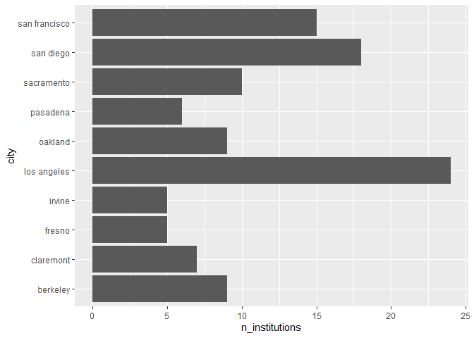
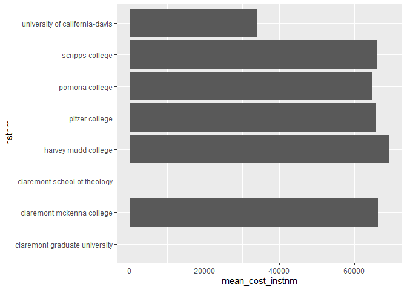
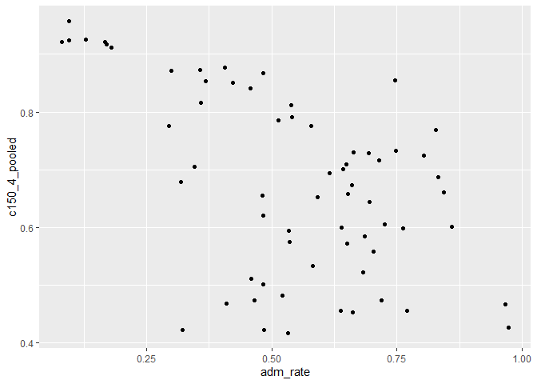
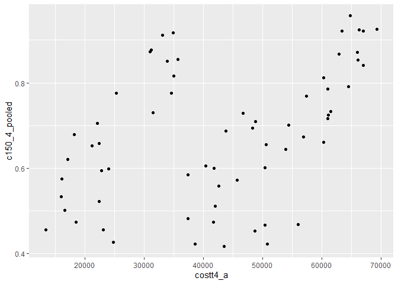
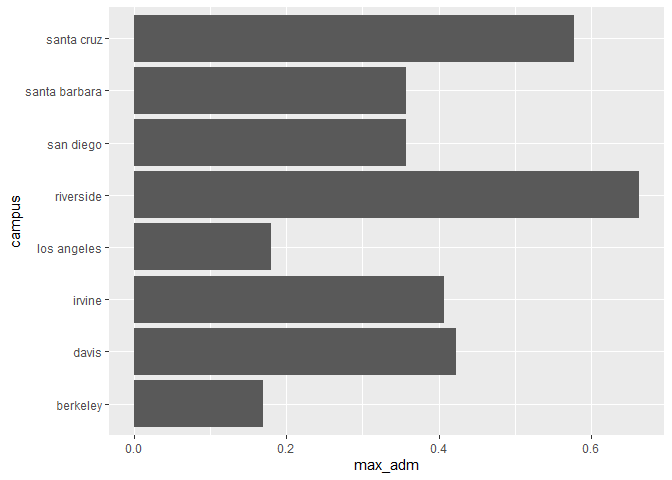
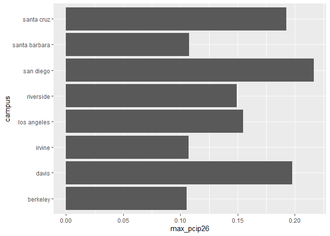

## Instructions
Answer the following questions and complete the exercises in RMarkdown. Please embed all of your code and push your final work to your repository. Your final lab report should be organized, clean, and run free from errors. Remember, you must remove the `#` for the included code chunks to run. Be sure to add your name to the author header above.  

Make sure to use the formatting conventions of RMarkdown to make your report neat and clean!  

## Load the libraries

```r
library(tidyverse)
library(janitor)
library(naniar)
```

For this homework, we will take a departure from biological data and use data about California colleges. These data are a subset of the national college scorecard (https://collegescorecard.ed.gov/data/). Load the `ca_college_data.csv` as a new object called `colleges`.

```r
colleges <- readr::read_csv("data/ca_college_data.csv") %>% janitor::clean_names() 
```

```
## Rows: 341 Columns: 10
## ── Column specification ────────────────────────────────────────────────────────
## Delimiter: ","
## chr (4): INSTNM, CITY, STABBR, ZIP
## dbl (6): ADM_RATE, SAT_AVG, PCIP26, COSTT4_A, C150_4_POOLED, PFTFTUG1_EF
## 
## ℹ Use `spec()` to retrieve the full column specification for this data.
## ℹ Specify the column types or set `show_col_types = FALSE` to quiet this message.
```

The variables are a bit hard to decipher, here is a key:  

INSTNM: Institution name  
CITY: California city  
STABBR: Location state  
ZIP: Zip code  
ADM_RATE: Admission rate  
SAT_AVG: SAT average score  
PCIP26: Percentage of degrees awarded in Biological And Biomedical Sciences  
COSTT4_A: Annual cost of attendance  
C150_4_POOLED: 4-year completion rate  
PFTFTUG1_EF: Percentage of undergraduate students who are first-time, full-time degree/certificate-seeking undergraduate students  

1. Use your preferred function(s) to have a look at the data and get an idea of its structure. Make sure you summarize NA's and determine whether or not the data are tidy. You may also consider dealing with any naming issues.


```r
colleges <- colleges %>% 
  mutate(across(everything(), tolower))
```


```r
glimpse(colleges)
```

```
## Rows: 341
## Columns: 10
## $ instnm        <chr> "grossmont college", "college of the sequoias", "college…
## $ city          <chr> "el cajon", "visalia", "san mateo", "ventura", "oxnard",…
## $ stabbr        <chr> "ca", "ca", "ca", "ca", "ca", "ca", "ca", "ca", "ca", "c…
## $ zip           <chr> "92020-1799", "93277-2214", "94402-3784", "93003-3872", …
## $ adm_rate      <chr> NA, NA, NA, NA, NA, NA, NA, NA, NA, NA, NA, NA, NA, NA, …
## $ sat_avg       <chr> NA, NA, NA, NA, NA, NA, NA, NA, NA, NA, NA, NA, NA, NA, …
## $ pcip26        <chr> "0.0016", "0.0066", "0.0038", "0.0035", "0.0085", "0.015…
## $ costt4_a      <chr> "7956", "8109", "8278", "8407", "8516", "8577", "8580", …
## $ c150_4_pooled <chr> NA, NA, NA, NA, NA, NA, "0.2334", NA, NA, NA, NA, "0.170…
## $ pftftug1_ef   <chr> "0.3546", "0.5413", "0.3567", "0.3824", "0.2753", "0.428…
```

```r
miss_var_summary(colleges)
```

```
## # A tibble: 10 × 3
##    variable      n_miss pct_miss
##    <chr>          <int>    <num>
##  1 sat_avg          276     80.9
##  2 adm_rate         240     70.4
##  3 c150_4_pooled    221     64.8
##  4 costt4_a         124     36.4
##  5 pftftug1_ef       53     15.5
##  6 pcip26            35     10.3
##  7 instnm             0      0  
##  8 city               0      0  
##  9 stabbr             0      0  
## 10 zip                0      0
```

2. Which cities in California have the highest number of colleges?

Los Angeles.


```r
colleges %>% 
  count(stabbr)
```

```
## # A tibble: 3 × 2
##   stabbr     n
##   <chr>  <int>
## 1 az         1
## 2 ca       339
## 3 mn         1
```

```r
n_institutions_per_ca_city <- colleges %>% 
  filter(stabbr == "ca") %>% 
  select(city, instnm) %>% 
  group_by(city) %>% 
  summarize(n_institutions = n_distinct(instnm)) %>% 
  arrange(desc(n_institutions))
head(n_institutions_per_ca_city, n=1)
```

```
## # A tibble: 1 × 2
##   city        n_institutions
##   <chr>                <int>
## 1 los angeles             24
```


3. Based on your answer to #2, make a plot that shows the number of colleges in the top 10 cities.

```r
n_institutions_per_ca_city %>% 
  head(, n=10) %>% 
  ggplot(aes(x= n_institutions , y= city)) +
  geom_col()
```

<!-- -->

4. The column `COSTT4_A` is the annual cost of each institution. Which city has the highest average cost? Where is it located?

Claremont has the highest average cost with a cost of 66498 dollars. It is located in CA. 


```r
colleges %>% 
  select(city, instnm, stabbr, zip, costt4_a) %>% 
  mutate(costt4_a = as.numeric(costt4_a)) %>% 
  group_by(city, stabbr) %>% 
  summarize(mean_cost = mean(costt4_a, na.rm=T), .groups = "drop") %>% 
  arrange(desc(mean_cost)) %>% 
  head(,n=1)
```

```
## # A tibble: 1 × 3
##   city      stabbr mean_cost
##   <chr>     <chr>      <dbl>
## 1 claremont ca         66498
```

5. Based on your answer to #4, make a plot that compares the cost of the individual colleges in the most expensive city. Bonus! Add UC Davis here to see how it compares :>).

```r
colleges %>% 
  select(city, instnm, stabbr, zip, costt4_a) %>% 
  mutate(costt4_a = as.numeric(costt4_a)) %>% 
  filter(city %in% c("claremont", "davis")) %>% 
  group_by(instnm) %>% 
  summarize(mean_cost_instnm = mean(costt4_a, na.rm=T), .groups = "drop") %>% 
  ggplot(aes(x= instnm, y= mean_cost_instnm)) + 
  geom_col() +
  coord_flip()
```

```
## Warning: Removed 2 rows containing missing values (`position_stack()`).
```

<!-- -->

6. The column `ADM_RATE` is the admissions rate by college and `C150_4_POOLED` is the four-year completion rate. Use a scatterplot to show the relationship between these two variables. What do you think this means?

There appears to be a slight negative correlation between the four year completion rate and the admission rate where more students admitted lead to less students completing four years of college.

```r
colleges %>% 
  mutate(adm_rate = as.numeric(adm_rate), 
         c150_4_pooled = as.numeric(c150_4_pooled)) %>% 
  na.omit() %>% 
  ggplot(aes(x = adm_rate, y=c150_4_pooled)) +
  geom_point()
```

<!-- -->

7. Is there a relationship between cost and four-year completion rate? (You don't need to do the stats, just produce a plot). What do you think this means?

There appears to be a positive correlation where higher college cost leads to more students completing four years.

```r
colleges %>% 
  mutate(costt4_a = as.numeric(costt4_a), 
         c150_4_pooled = as.numeric(c150_4_pooled)) %>% 
  na.omit() %>% 
  ggplot(aes(x = costt4_a, y=c150_4_pooled)) +
  geom_point()
```

<!-- -->

8. The column titled `INSTNM` is the institution name. We are only interested in the University of California colleges. Make a new data frame that is restricted to UC institutions. You can remove `Hastings College of Law` and `UC San Francisco` as we are only interested in undergraduate institutions.

```r
uc_colleges <- colleges %>% 
  filter(startsWith(instnm, "university of california-"))
uc_colleges
```

```
## # A tibble: 10 × 10
##    instnm      city  stabbr zip   adm_rate sat_avg pcip26 costt4_a c150_4_pooled
##    <chr>       <chr> <chr>  <chr> <chr>    <chr>   <chr>  <chr>    <chr>        
##  1 university… la j… ca     92093 0.3566   1324    0.2165 31043    0.8724       
##  2 university… irvi… ca     92697 0.4065   1206    0.1073 31198    0.8764       
##  3 university… rive… ca     92521 0.6634   1078    0.1491 31494    0.73         
##  4 university… los … ca     9009… 0.1799   1334    0.1548 33078    0.9112       
##  5 university… davis ca     9561… 0.4228   1218    0.1975 33904    0.8502       
##  6 university… sant… ca     9506… 0.5785   1201    0.1927 34608    0.7764       
##  7 university… berk… ca     94720 0.1693   1422    0.1053 34924    0.9165       
##  8 university… sant… ca     93106 0.3577   1281    0.1075 34998    0.8157       
##  9 university… san … ca     9410… <NA>     <NA>    <NA>   <NA>     <NA>         
## 10 university… san … ca     9414… <NA>     <NA>    <NA>   <NA>     <NA>         
## # ℹ 1 more variable: pftftug1_ef <chr>
```

Remove `Hastings College of Law` and `UC San Francisco` and store the final data frame as a new object `univ_calif_final`.

```r
univ_calif_final <- uc_colleges %>% 
  filter(instnm != "university of california-hastings college of law", instnm != "university of california-san francisco")
univ_calif_final
```

```
## # A tibble: 8 × 10
##   instnm       city  stabbr zip   adm_rate sat_avg pcip26 costt4_a c150_4_pooled
##   <chr>        <chr> <chr>  <chr> <chr>    <chr>   <chr>  <chr>    <chr>        
## 1 university … la j… ca     92093 0.3566   1324    0.2165 31043    0.8724       
## 2 university … irvi… ca     92697 0.4065   1206    0.1073 31198    0.8764       
## 3 university … rive… ca     92521 0.6634   1078    0.1491 31494    0.73         
## 4 university … los … ca     9009… 0.1799   1334    0.1548 33078    0.9112       
## 5 university … davis ca     9561… 0.4228   1218    0.1975 33904    0.8502       
## 6 university … sant… ca     9506… 0.5785   1201    0.1927 34608    0.7764       
## 7 university … berk… ca     94720 0.1693   1422    0.1053 34924    0.9165       
## 8 university … sant… ca     93106 0.3577   1281    0.1075 34998    0.8157       
## # ℹ 1 more variable: pftftug1_ef <chr>
```

Use `separate()` to separate institution name into two new columns "UNIV" and "CAMPUS".

```r
univ_cal_final <- univ_calif_final %>% 
  separate(instnm, into = c("univ", "campus"), sep = "-")
univ_cal_final
```

```
## # A tibble: 8 × 11
##   univ  campus city  stabbr zip   adm_rate sat_avg pcip26 costt4_a c150_4_pooled
##   <chr> <chr>  <chr> <chr>  <chr> <chr>    <chr>   <chr>  <chr>    <chr>        
## 1 univ… san d… la j… ca     92093 0.3566   1324    0.2165 31043    0.8724       
## 2 univ… irvine irvi… ca     92697 0.4065   1206    0.1073 31198    0.8764       
## 3 univ… river… rive… ca     92521 0.6634   1078    0.1491 31494    0.73         
## 4 univ… los a… los … ca     9009… 0.1799   1334    0.1548 33078    0.9112       
## 5 univ… davis  davis ca     9561… 0.4228   1218    0.1975 33904    0.8502       
## 6 univ… santa… sant… ca     9506… 0.5785   1201    0.1927 34608    0.7764       
## 7 univ… berke… berk… ca     94720 0.1693   1422    0.1053 34924    0.9165       
## 8 univ… santa… sant… ca     93106 0.3577   1281    0.1075 34998    0.8157       
## # ℹ 1 more variable: pftftug1_ef <chr>
```

9. The column `ADM_RATE` is the admissions rate by campus. Which UC has the lowest and highest admissions rates? Produce a numerical summary and an appropriate plot.

UC with the highest admission rate is riverside. While the UC campus with the lowest admission rate is Berkeley.


```r
univ_cal_final %>% 
  mutate(adm_rate = as.numeric(adm_rate)) %>% 
  select(campus, adm_rate) %>% 
  group_by(campus) %>% 
  summarize(min_adm = min(adm_rate, na.rm = T), 
            max_adm = max(adm_rate, na.rm = T)) %>% 
  arrange(desc(max_adm))
```

```
## # A tibble: 8 × 3
##   campus        min_adm max_adm
##   <chr>           <dbl>   <dbl>
## 1 riverside       0.663   0.663
## 2 santa cruz      0.578   0.578
## 3 davis           0.423   0.423
## 4 irvine          0.406   0.406
## 5 santa barbara   0.358   0.358
## 6 san diego       0.357   0.357
## 7 los angeles     0.180   0.180
## 8 berkeley        0.169   0.169
```


```r
univ_cal_final %>% 
  mutate(adm_rate = as.numeric(adm_rate)) %>% 
  select(campus, adm_rate) %>% 
  group_by(campus) %>% 
  summarize(min_adm = min(adm_rate, na.rm = T), 
            max_adm = max(adm_rate, na.rm = T)) %>% 
  ggplot(aes(x= campus, y=max_adm)) + 
  geom_col() + 
  coord_flip()
```

<!-- -->

10. If you wanted to get a degree in biological or biomedical sciences, which campus confers the majority of these degrees? Produce a numerical summary and an appropriate plot. PCIP26: Percentage of degrees awarded in Biological And Biomedical Sciences

I assumed this is referring to only the UC campuses. It appears like san diego gives out the max number of degrees awarded in biological and biomedical sciences.


```r
univ_cal_final %>% 
  mutate(pcip26 = as.numeric(pcip26)) %>% 
  select(campus, pcip26) %>% 
  group_by(campus) %>% 
  summarize(max_pcip26 = max(pcip26, na.rm=T)) %>% 
  arrange(desc(max_pcip26))
```

```
## # A tibble: 8 × 2
##   campus        max_pcip26
##   <chr>              <dbl>
## 1 san diego          0.216
## 2 davis              0.198
## 3 santa cruz         0.193
## 4 los angeles        0.155
## 5 riverside          0.149
## 6 santa barbara      0.108
## 7 irvine             0.107
## 8 berkeley           0.105
```


```r
univ_cal_final %>% 
  mutate(pcip26 = as.numeric(pcip26)) %>% 
  select(campus, pcip26) %>% 
  group_by(campus) %>% 
  summarize(max_pcip26 = max(pcip26, na.rm=T)) %>% 
  ggplot(aes(x=campus, y= max_pcip26)) +
  geom_col() + 
  coord_flip()
```

<!-- -->
## Knit Your Output and Post to [GitHub](https://github.com/FRS417-DataScienceBiologists)
