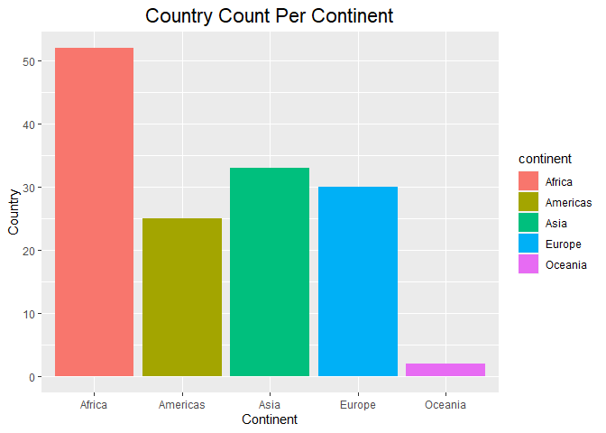
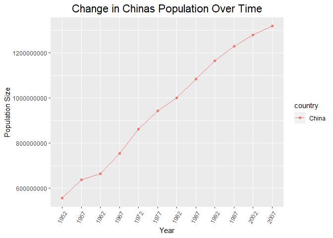
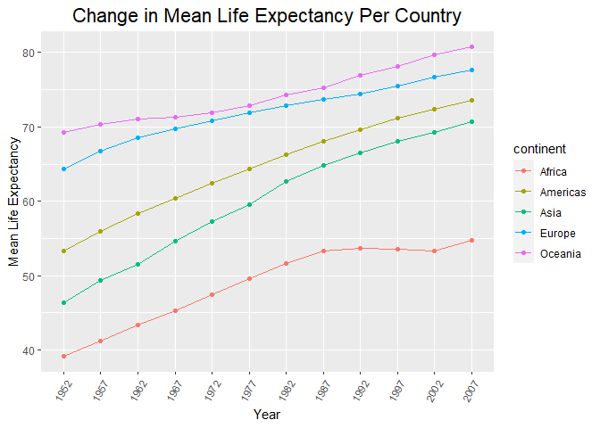
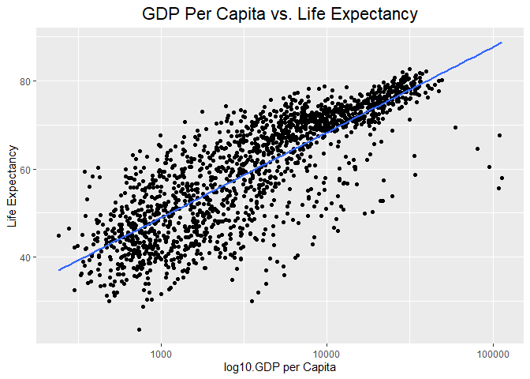
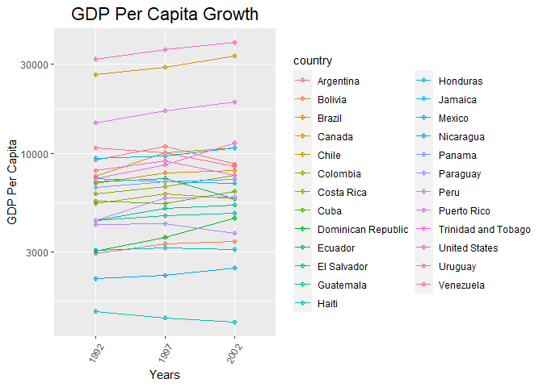

## Instructions
Answer the following questions and complete the exercises in RMarkdown. Please embed all of your code and push your final work to your repository. Your final lab report should be organized, clean, and run free from errors. Remember, you must remove the `#` for the included code chunks to run. Be sure to add your name to the author header above. For any included plots, make sure they are clearly labeled. You are free to use any plot type that you feel best communicates the results of your analysis.  

Make sure to use the formatting conventions of RMarkdown to make your report neat and clean!  

## Load the libraries

```r
library(tidyverse)
library(janitor)
library(naniar)
```


```r
options(scipen = 999)
```

## Resources
The idea for this assignment came from [Rebecca Barter's](http://www.rebeccabarter.com/blog/2017-11-17-ggplot2_tutorial/) ggplot tutorial so if you get stuck this is a good place to have a look.  

## Gapminder
For this assignment, we are going to use the dataset [gapminder](https://cran.r-project.org/web/packages/gapminder/index.html). Gapminder includes information about economics, population, and life expectancy from countries all over the world. You will need to install it before use.  

```r
#install.packages("gapminder")
library("gapminder")
```

1. Use the function(s) of your choice to get an idea of the overall structure of the data frame, including its dimensions, column names, variable classes, etc. As part of this, determine how NA's are treated in the data.   

There does not appear to be any NA's in the dataset.


```r
gapminder <- gapminder #might have to change year to a factor
```


```r
glimpse(gapminder)
```

```
## Rows: 1,704
## Columns: 6
## $ country   <fct> "Afghanistan", "Afghanistan", "Afghanistan", "Afghanistan", …
## $ continent <fct> Asia, Asia, Asia, Asia, Asia, Asia, Asia, Asia, Asia, Asia, …
## $ year      <int> 1952, 1957, 1962, 1967, 1972, 1977, 1982, 1987, 1992, 1997, …
## $ lifeExp   <dbl> 28.801, 30.332, 31.997, 34.020, 36.088, 38.438, 39.854, 40.8…
## $ pop       <int> 8425333, 9240934, 10267083, 11537966, 13079460, 14880372, 12…
## $ gdpPercap <dbl> 779.4453, 820.8530, 853.1007, 836.1971, 739.9811, 786.1134, …
```

```r
dim(gapminder)
```

```
## [1] 1704    6
```

```r
names(gapminder)
```

```
## [1] "country"   "continent" "year"      "lifeExp"   "pop"       "gdpPercap"
```

```r
str(gapminder)
```

```
## tibble [1,704 × 6] (S3: tbl_df/tbl/data.frame)
##  $ country  : Factor w/ 142 levels "Afghanistan",..: 1 1 1 1 1 1 1 1 1 1 ...
##  $ continent: Factor w/ 5 levels "Africa","Americas",..: 3 3 3 3 3 3 3 3 3 3 ...
##  $ year     : int [1:1704] 1952 1957 1962 1967 1972 1977 1982 1987 1992 1997 ...
##  $ lifeExp  : num [1:1704] 28.8 30.3 32 34 36.1 ...
##  $ pop      : int [1:1704] 8425333 9240934 10267083 11537966 13079460 14880372 12881816 13867957 16317921 22227415 ...
##  $ gdpPercap: num [1:1704] 779 821 853 836 740 ...
```

```r
miss_var_summary(gapminder)
```

```
## # A tibble: 6 × 3
##   variable  n_miss pct_miss
##   <chr>      <int>    <num>
## 1 country        0        0
## 2 continent      0        0
## 3 year           0        0
## 4 lifeExp        0        0
## 5 pop            0        0
## 6 gdpPercap      0        0
```

```r
gapminder %>% 
  replace_with_na_all(condition = ~.x %in% c(common_na_strings, common_na_numbers))
```

```
## # A tibble: 1,704 × 6
##    country     continent  year lifeExp      pop gdpPercap
##    <fct>       <fct>     <int>   <dbl>    <int>     <dbl>
##  1 Afghanistan Asia       1952    28.8  8425333      779.
##  2 Afghanistan Asia       1957    30.3  9240934      821.
##  3 Afghanistan Asia       1962    32.0 10267083      853.
##  4 Afghanistan Asia       1967    34.0 11537966      836.
##  5 Afghanistan Asia       1972    36.1 13079460      740.
##  6 Afghanistan Asia       1977    38.4 14880372      786.
##  7 Afghanistan Asia       1982    39.9 12881816      978.
##  8 Afghanistan Asia       1987    40.8 13867957      852.
##  9 Afghanistan Asia       1992    41.7 16317921      649.
## 10 Afghanistan Asia       1997    41.8 22227415      635.
## # ℹ 1,694 more rows
```

2. How many countries are represented in this dataset? Make a table and a plot that shows the number of countries by continent.  


```r
gapminder %>% 
  select(country, continent) %>% 
  group_by(continent) %>% 
  summarize(n_countries = n_distinct(country)) %>% 
  ggplot(aes(x= continent, y=n_countries, fill=continent)) + 
  geom_col() + 
  labs(title= "Country Count Per Continent",
       x="Continent",
       y= "Country") + 
  theme(plot.title=element_text(size=rel(1.5),hjust=0.5))
```

<!-- -->


3. Which country has the largest population growth since 1952? Show this as a table.

China has the largest population growth since 1952.


```r
gap_chng_pop <- gapminder %>% 
  select(country, pop, year) %>%
  filter(year == "1952" | year == "2007") %>% 
  group_by(country) %>%
  pivot_wider( 
              names_from = year,
              values_from = pop) %>% 
  mutate(chang_pop = `2007` - `1952`) %>% 
  arrange(desc(chang_pop))
gap_chng_pop %>% head(,n=1)
```

```
## # A tibble: 1 × 4
## # Groups:   country [1]
##   country    `1952`     `2007` chang_pop
##   <fct>       <int>      <int>     <int>
## 1 China   556263527 1318683096 762419569
```

4. Make a plot that shows population growth for the country you found in question #3. This plot should show the change over time.  

```r
gapminder %>% 
  filter(country == "China") %>% 
  mutate(year = as.factor(year)) %>% 
  ggplot(aes(x = year, y= pop, group = country, color = country))+
  geom_line() +
  geom_point() +
  labs(title = "Change in Chinas Population Over Time",
       y = "Population Size",
       x = "Year")+
  theme(axis.text.x=element_text(angle = 60, hjust=1))+
  theme(plot.title=element_text(size=rel(1.5),hjust=0.5))
```

<!-- -->

5. How has global life expectancy changed between 1952 and 2007? Show the min, mean, and max for all countries in the dataset. Show this as a table.  


```r
gapminder %>% 
  select(country, year, lifeExp) %>% 
  group_by(country) %>%
  pivot_wider( 
              names_from = year,
              values_from = lifeExp) %>% 
  summarize(min_lifeExp = min(`1952`:`2007`),
            max_lifeExp = max(`1952`:`2007`),
            mean_lifeExp = mean(`1952`:`2007`))
```

```
## # A tibble: 142 × 4
##    country     min_lifeExp max_lifeExp mean_lifeExp
##    <fct>             <dbl>       <dbl>        <dbl>
##  1 Afghanistan        28.8        43.8         36.3
##  2 Albania            55.2        76.2         65.7
##  3 Algeria            43.1        72.1         57.6
##  4 Angola             30.0        42.0         36.0
##  5 Argentina          62.5        74.5         68.5
##  6 Australia          69.1        81.1         75.1
##  7 Austria            66.8        79.8         73.3
##  8 Bahrain            50.9        74.9         62.9
##  9 Bangladesh         37.5        63.5         50.5
## 10 Belgium            68          79           73.5
## # ℹ 132 more rows
```

6. Make a plot that shows how mean life expectancy has changed over time for each continent. What is your interpretation of what happened in Africa between 1987 and 2002? 

Between 1987 and 2002l the life expectancy of African people appears to have been stagnant at about 53 years. This could most likely be due to a large amount of deaths occurring at the time due to famine and other disasters.


```r
gapminder %>% 
  select(continent, year, lifeExp) %>% 
  mutate(year = as.factor(year)) %>% 
  group_by(continent, year) %>% 
  summarize(mean_lifeExp = mean(lifeExp)) %>% 
  ggplot(aes(x= year, y= mean_lifeExp, group = continent, color = continent))+
  geom_line() +
  geom_point()+
  labs(title = "Change in Mean Life Expectancy Per Country",
       x= "Year",
       y="Mean Life Expectancy")+
  theme(axis.text.x=element_text(angle = 60, hjust=1))+
  theme(plot.title=element_text(size=rel(1.5),hjust=0.5))
```

```
## `summarise()` has grouped output by 'continent'. You can override using the
## `.groups` argument.
```

<!-- -->


7. We are interested in the relationship between per capita GDP and life expectancy; i.e. does having more money help you live longer? Show this as a plot.  


```r
gapminder %>% 
  select(gdpPercap, lifeExp) %>% 
  ggplot(aes(x= gdpPercap, y= lifeExp)) +
  geom_jitter()+
  geom_smooth(method=lm,se=F) + 
  labs(,title= "GDP Per Capita vs. Life Expectancy",
       x="log10.GDP per Capita",
       y= "Life Expectancy") + 
  theme(plot.title=element_text(size=rel(1.5),hjust=0.5))+
  scale_x_log10()
```

```
## `geom_smooth()` using formula = 'y ~ x'
```

<!-- -->


8. Which five countries have had the highest GDP per capital growth over the years represented in this dataset? Show this as a table.

Singapore, Norway, Hong Kong, Ireland and Austria have had the highest GDP per capital growth over the years represented in the dataset. 


```r
gapminder %>% 
  select(country, year, gdpPercap) %>% 
  group_by(country) %>% 
   pivot_wider( 
              names_from = year,
              values_from = gdpPercap) %>% 
  mutate(chng_gdp = `2007`-`1952`) %>% 
  select(country, chng_gdp) %>% 
  arrange(desc(chng_gdp)) %>% 
  head(,n=5)
```

```
## # A tibble: 5 × 2
## # Groups:   country [5]
##   country          chng_gdp
##   <fct>               <dbl>
## 1 Singapore          44828.
## 2 Norway             39262.
## 3 Hong Kong, China   36671.
## 4 Ireland            35466.
## 5 Austria            29989.
```

9. How does per capita GDP growth compare between these same five countries? Show this as a plot.  

```r
gapminder %>% 
  select(country, year, gdpPercap) %>% 
  mutate(year = as.factor(year)) %>% 
  group_by(country) %>% 
  filter(country %in% c("Singapore" ,"Norway" , "Hong Kong, China" , "Ireland" , "Austria")) %>%
  ggplot(aes(x= year, y= gdpPercap, group = country, color = country))+
  geom_line()+
  geom_point()+
  labs(,title= "GDP Per Capita Growth",
       x="Years",
       y= "GDP Per Capita") + 
  theme(axis.text.x=element_text(angle = 60, hjust=1))+
  theme(plot.title=element_text(size=rel(1.5),hjust=0.5))
```

<!-- -->


10. Do one analysis of your choice that includes a table and plot as outputs. 

What was the GDP per capita growth of the North and South American countries during the 1990's-2000's switch? Show this as a line plot over time.


```r
gapminder %>% 
  select(continent, country, year, gdpPercap) %>% 
  mutate(year = as.factor(year)) %>% 
  filter(year %in% 1992:2002,  continent == "Americas") %>% 
  ggplot(aes(x= year, y= gdpPercap, group = country, color = country))+
  geom_line()+
  geom_point(shape = 10)+
   labs(,title= "GDP Per Capita Growth",
       x="Years",
       y= "GDP Per Capita") + 
  theme(axis.text.x=element_text(angle = 60, hjust=1))+
  theme(plot.title=element_text(size=rel(1.5),hjust=0.5))+
  scale_y_log10()
```

<!-- -->


## Knit and Upload
Please knit your work as a .pdf or .html file and upload to Canvas. Homework is due before the start of the next lab. No late work is accepted. Make sure to use the formatting conventions of RMarkdown to make your report neat and clean! 
