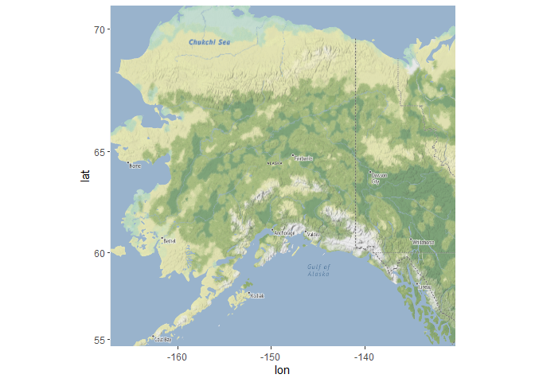
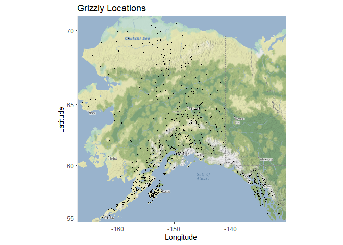

## Instructions
Answer the following questions and complete the exercises in RMarkdown. Please embed all of your code and push your final work to your repository. Your final lab report should be organized, clean, and run free from errors. Remember, you must remove the `#` for the included code chunks to run. Be sure to add your name to the author header above. For any included plots, make sure they are clearly labeled. You are free to use any plot type that you feel best communicates the results of your analysis.  

Make sure to use the formatting conventions of RMarkdown to make your report neat and clean!  

## Load the libraries  

```r
library(tidyverse)
library(janitor)
library(ggmap)
```

## Load the Data
We will use two separate data sets for this homework.  

The first [data set](https://rcweb.dartmouth.edu/~f002d69/workshops/index_rspatial.html) represent sightings of grizzly bears (Ursos arctos) in Alaska.  


```r
register_stadiamaps("aa2920a3-11e4-475e-82c1-18552c632fd2", write = FALSE)
```

1. Load the `grizzly` data and evaluate its structure.  

```r
grizzly <- read.csv("data/bear-sightings.csv")
```


```r
dim(grizzly)
```

```
## [1] 494   3
```


```r
str(grizzly)
```

```
## 'data.frame':	494 obs. of  3 variables:
##  $ bear.id  : int  7 57 69 75 104 108 115 116 125 135 ...
##  $ longitude: num  -149 -153 -145 -153 -143 ...
##  $ latitude : num  62.7 58.4 62.4 59.9 61.1 ...
```


2. Use the range of the latitude and longitude to build an appropriate bounding box for your map.  

```r
summary(grizzly)
```

```
##     bear.id       longitude         latitude    
##  Min.   :   7   Min.   :-166.2   Min.   :55.02  
##  1st Qu.:2569   1st Qu.:-154.2   1st Qu.:58.13  
##  Median :4822   Median :-151.0   Median :60.97  
##  Mean   :4935   Mean   :-149.1   Mean   :61.41  
##  3rd Qu.:7387   3rd Qu.:-145.6   3rd Qu.:64.13  
##  Max.   :9996   Max.   :-131.3   Max.   :70.37
```

```r
lat <- c(55.02,70.37)
long <- c(-166.2, -131.3)
bbox <- make_bbox(long, lat, f=0.03)
```

3. Load a map from `stadiamaps` in a `stamen_terrain` projection and display the map. Hint: use zoom=5.  

```r
map1 <- get_stadiamap(bbox, maptype = "stamen_terrain", zoom=5)
```

```
## ℹ © Stadia Maps © Stamen Design © OpenMapTiles © OpenStreetMap contributors.
```


```r
ggmap(map1)
```

<!-- -->

4. Build a final map that overlays the recorded observations of grizzly bears in Alaska.  

```r
ggmap(map1) + 
  geom_point(data = grizzly, aes(longitude, latitude), size=0.4) +
  labs(x= "Longitude", y= "Latitude", title="Grizzly Locations")
```

<!-- -->

## Push your final code to GitHub!
Please be sure that you check the `keep md` file in the knit preferences. 
